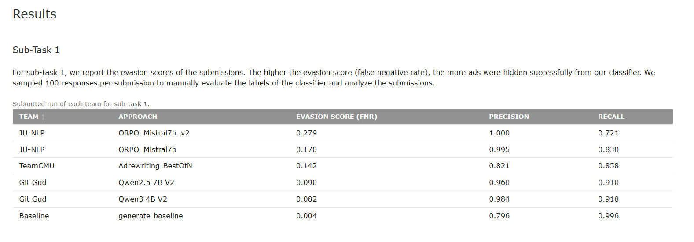
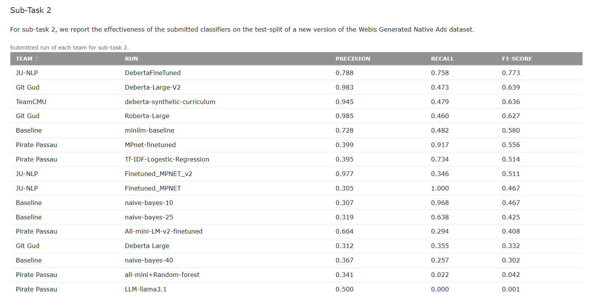

# 🧠 GitGud at Touché 2025: Advertisement Generation & Detection in RAG-based LLMs

### 🏅 2nd & 4th International Rankings | Presented at CLEF 2025, Madrid 🇪🇸

This repository contains our submission to the **Touché Lab @ CLEF 2025** — tackling the challenge of **“Advertisements in Retrieval-Augmented Generation (RAG)”**.
Our work explored two fundamental questions:

1️⃣ Can LLMs **generate native ads** so natural they’re hard to detect?

2️⃣ Can we **detect** those ads effectively using transformer-based models?

Our team **GitGud (Habib University)** designed a **unified RAG pipeline** and fine-tuned multiple **transformer architectures** for both generation and detection tasks.
This project was presented in person at **CLEF 2025, UNED Madrid**, after achieving top-tier leaderboard results across both subtasks.

---

## 📂 Repository Structure

```
📁 Advertisement-in-Retrieval-Augmented-Generation-2025
│
├── 📁 Subtask1/                  # Advertisement Generation in RAG-based LLMs
│   ├── Subtask1.ipynb            # Full unified RAG pipeline (retrieval → reranking → generation → validation)
│   └── models/                   # Optional model configs or checkpoints (if shared)
│
└── 📁 Subtask2/                  # Advertisement Detection using Transformers
    ├── deberta-v3-large/         # Fine-tuned model 1
    ├── deberta-v3-base/          # Fine-tuned model 2
    ├── roberta-large/            # Fine-tuned model 3
    └── roberta-base/             # Fine-tuned model 4
```

---

## 🧩 **Subtask 1 — Advertisement Generation (RAG)**

We developed a **Retrieval-Augmented Generation pipeline** integrating:

* **FAISS-based document retrieval**
* **Cross-encoder reranking** for relevance optimization
* **Qwen 2.5–7B** for contextual generation
* A **naturalness scoring loop** to evaluate ad placement, coherence, and contextual flow
* Outputs verified using our **Subtask 2 detector** for ethical validation

🏆 **Leaderboard Result:**

* **4th (officially)** and **2nd (unofficially)** in international ranking

---

## 🔍 **Subtask 2 — Advertisement Detection**

We fine-tuned multiple transformer architectures for binary ad detection:

* **DeBERTa-v3-Large** 🥇 *(Best-performing model — F1: 0.639)*
* DeBERTa-v3-Base
* RoBERTa-Large
* RoBERTa-Base

Our final ensemble approach demonstrated **strong robustness** across multilingual and stylistically diverse ad data.

🏆 **Leaderboard Result:**

* **2nd and 4th internationally**

---

## 🧠 **Key Insights**

* LLMs can **embed ads seamlessly** within generated text — raising critical questions about **transparency** and **ethics**.
* **Transformer-based detectors** are effective at identifying subtle ad patterns.
* Combining **retrieval, generation, and detection** yields powerful, controlled generative AI pipelines.

---

## 📊 **Achievements**

* 🥈 **2nd & 4th international ranking** across subtasks
* 🎓 **Presented at CLEF 2025, Madrid (UNED)**
* 🧾 **Accepted research paper:** *“Git Gud at Touché: Unified RAG Pipeline for Native Ad Generation and Detection”*
* 🌍 **Represented Habib University (Pakistan)** among global research teams

---

## 🔗 **Resources**

📄 **Research Paper:** [Read on CEUR-WS / CLEF 2025 Proceedings](https://lnkd.in/dbyJXMmT)

🌐 **Touché Lab Overview:** [touche.webis.de/clef25/touche25-web](https://touche.webis.de/clef25/touche25-web/advertisement-detection.html)

---

## 📸 **Leaderboard & Conference Screenshots**

**Subtask 1 (Advertisement Generation):**


**Subtask 2 (Advertisement Detection):**


---

## 🙌 **Acknowledgments**

Special thanks to:

* **Dr. Faisal Alvi**, **Dr. Abdul Samad** — for mentorship and guidance
* **Teammates:** Muhammad Taqi & Ansab Chaudhary — for their hard work and collaboration
* **Touché Organizers:** Sebastian Heineking & Johannes Kiesel — for their support and hospitality at CLEF 2025

---

## 🚀 **Future Work**

* Expanding multilingual generalization of ad detection
* Integrating adversarial training for stealth ad identification
* Exploring ethical frameworks for LLM-based content generation

---

### 💡 *"Research isn’t just about code — it’s about curiosity, collaboration, and the courage to test what’s possible."*
